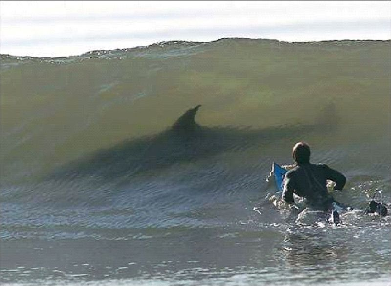

# Shark attacks: a pandas project

In this exercise we worked with a Global Shark Attack File dataset as found in the Kaggle webpage.

https://www.kaggle.com/teajay/global-shark-attacks/version/1

The objective of this mini-project is to do an exercise to clean this messy dataset. This will allow us to perform an analysis of the shark incident information. With the cleaned dataset, the objective is to visualize this data using matplotlib and seaborn to better draw a series of concrete conclusions from this noisy information.

The objective of my work is obtain the nature of the different type of shark attack incidents using a word frequency analysis. This is, without the need to spend days and days reading the injuries reports and the description of the activities related to the shark incident, to automatically mine information about the nature of the shark attacks and its circumstances. My hypothesis is that, looking at the word frequency, we can obtain information on whether some types of incidents are related with water sports such as surfing or swimming, other types related to fishing, etc. For example I prove that provoked incidents are related to fishing (rather than vandalism, as the name of the incident type could suggest).

In this readme, I will provide a summary of the data cleaning process and the analysis performed. In the jupyter-notebooks in the folder named "your-code" it is listed step by step all the processes related to this project.

The data-clean file describes the data cleaning process, while the data-wrangling one shows the visualization and analysis.

## Data cleaning

As downloaded from the Kaggle site, this dataset is very messy, but with very few commands we can transform this file into a valuable dataset. I conducted this with a diverse set of tools in python, as pandas or regex. I identified repeated columns and others without information. I corrected typos replacing text and obtained data from columns to create others. From the reports I cleaned the data to obtain species information when available.

Finally, there is a fraction of information that is not reliable and only introduces noise, so either I labeled accordingly or dropped it to create a valuable and reliable dataset to visualize and analyze.

## Visualization

With the information from the cleaned dataset, I plotted various information to obtain a broad description of the shark attacks available information. Here I list some properties of the data.

- The number of shark incidents recorded is growing constantly since the beginning of the reporting, except for one spike of shark incidents around 1960.
- The vast majority of the people involved with shark attacks are men.
- More people survive these attacks than die from shark incidents.
- The vast majority of the incidents are unprovoked, but both unprovoked incidents and sea disasters show the highest rates of fatality.
- There is a higher shark incident rate in summer time.
- The countries with the most recorded cases are USA, Australia and South Africa. The rest of the countries have less than 500 reported incidents since the XIX century.
- Normally there is no available information about the shark species, but when reported, the three species most frequent are White, Tiger and Bull sharks, in that order.

## Word frequency

By computing the word frequency of the activity and injuries reports, we can obtain the nature of the sharks attacks in the different types reported (Unprovoked, provoked, boat related, sea disasters and unknown ones). Below I show some highlights of the results of just looking at the word frequency:

- The majority of the words in unprovoked incidents are related to water activities (surfing, swimming, diving,...) and followed by fishing (fishing, spearfishing,...). There are many repetitions of the word fatal (as in sea disasters) compared with other categories. Sea Disasters, followed by Unprovoked incidents, show the highest fatality rates among all categories.
- Sea Disaster: These are more related to boat sanks and war events. In the injuries reports, the most common word is fatal. In this category, the mortality rate is the highest, so even if we wouldn't have the mortality, this would give us a hint
- Provoked: The most frequent words are related to fishing activities.
- Boating: As in the previous category, the most frequent word is fishing.

## Final Thoughts

Even considering the very limited time to perform analysis on this dataset, and just conducting only a few data cleaning and analysis techniques, we can obtain valuable and concrete information about shark incidents using word frequency. The tools that are available in python, that I applied some of them in this exercise, have a lot of potential for researching information in large datasets, that with classic approaches are impossible to handle.

